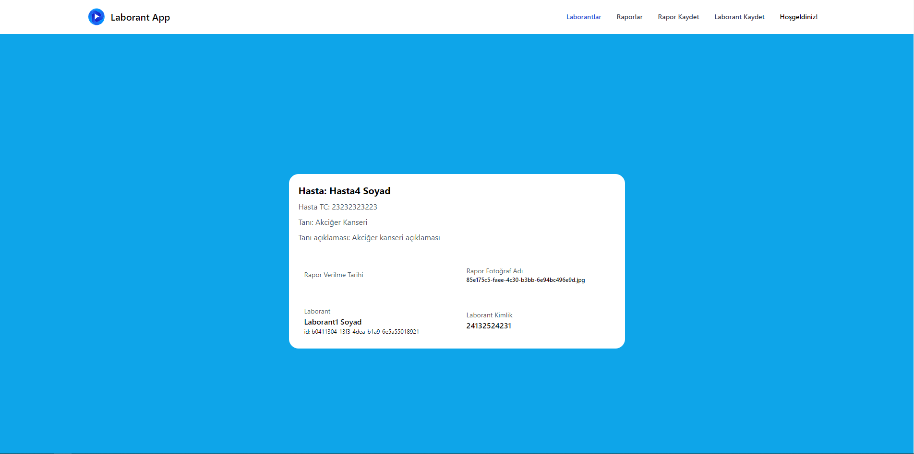

# Laborant Frontend

Backend için [Laborant Backend](https://github.com/mustafasansar44/laborant-backend).


```

Uygulamayı çalıştırabilmek için aşağıdaki adımları sırayla gerçekleştirebilirsiniz.
1- NodeJS'in yüklü olması gerekiyor.
2- React uygulamasının bulunduğu klasöre gidin.
3- Terminal veya CMD ile 'npm install' komutuyla bağımlılıkları yükleyin.
4- Projeyi başlatmak için 'npm start' komutunu kullanın.

```


```

Hastaların durumunu sisteme kayıt edebildiğiniz, hastaların durumunu detaylı olarak gözlemleyebildiğiniz veya laborantlarla ilgili aksiyonları (kısaca CRUD) gerçekleştirebildiğiniz bir uygulama. 

Backend OAuth2 kullandığım için login olunca API'den gelen tokeni sessionStorage'e aktarır. 
SessionStorage kullanmamdaki maksat site kapatıldığında token silinmesini istiyorum.

```

## Uygulama içi görüntüler





## Kalan görevler
- [] Rapor güncelleme
- [] Dinamik tarih
- [] Tarihe göre sıralama
- [] API'den dönen exceptionları yazdırma


